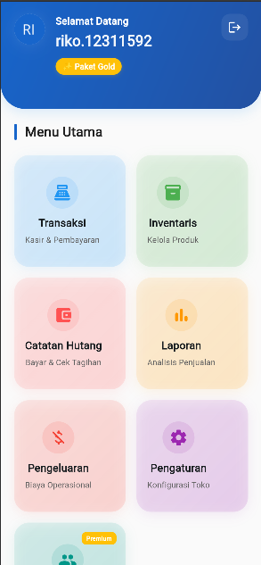
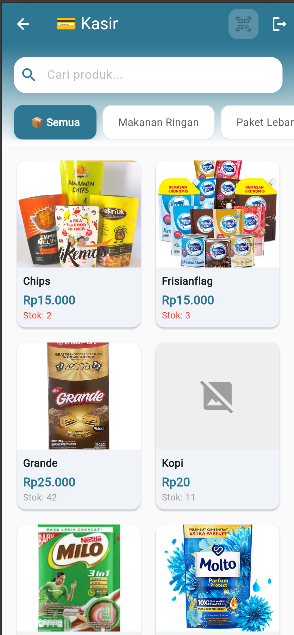
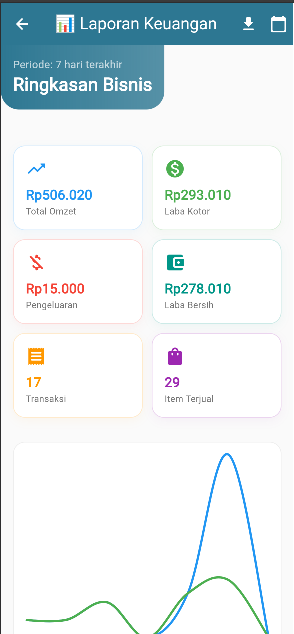

# EZZEN POS - Aplikasi Kasir & Manajemen UMKM 🚀


**EZZEN POS** adalah solusi *Point of Sale* (POS) dan manajemen bisnis *All-in-One* yang dirancang khusus untuk membantu UMKM di Indonesia mengelola operasional bisnis mereka secara digital, efisien, dan profesional.

Aplikasi ini tidak hanya mencatat transaksi kasir, tetapi juga mengelola stok, hutang-piutang pelanggan, pengeluaran operasional, hingga menyajikan laporan laba rugi secara otomatis.

## 📱 Fitur Unggulan

### 🏪 Point of Sale (Kasir Canggih)
* **Multi-Payment:** Mendukung pembayaran Tunai, Transfer Bank, QRIS, Hutang, dan *Split Payment*.
* **Koneksi Printer Thermal:** Cetak struk belanja langsung via Bluetooth (`blue_thermal_printer`).
* **Keranjang Belanja:** UI yang intuitif untuk menambah produk dan varian.

### 📦 Manajemen Inventaris
* **Stok Real-time:** Pelacakan stok otomatis yang berkurang saat transaksi.
* **Low Stock Alert:** Notifikasi visual di dashboard jika stok menipis.
* **Manajemen Produk & Kategori:** Tambah, edit, dan hapus produk dengan dukungan gambar dan varian harga.

### 📊 Laporan & Keuangan
* **Laporan Laba Rugi:** Menghitung Omzet, Laba Kotor, Pengeluaran, hingga **Laba Bersih (Net Profit)**.
* **Grafik Analitik:** Visualisasi tren penjualan harian, jam ramai (*peak hours*), dan produk terlaris (menggunakan `fl_chart`).
* **Ekspor PDF:** Cetak laporan keuangan profesional siap pakai untuk pembukuan.
* **Manajemen Pengeluaran:** Catat biaya operasional (listrik, gaji, sewa, dll) untuk perhitungan profit yang akurat.

### 📒 Manajemen Hutang (Kasbon)
* **Pencatatan Otomatis:** Transaksi non-tunai langsung tercatat di buku hutang.
* **Pelunasan Fleksibel:** Dukungan pembayaran cicilan atau pelunasan penuh per nota.
* **Detail Riwayat:** Lihat riwayat belanja dan pembayaran per pelanggan.

### ⚙️ Fitur Lainnya
* **Manajemen Karyawan:** Kelola akun kasir dengan hak akses berbeda (Owner/Admin/Cashier).
* **Pengaturan Toko:** Kustomisasi nama toko, info rekening, dan upload QRIS dinamis.
* **Sistem Langganan (Tiering):** Fitur terkunci berdasarkan paket Bronze, Silver, dan Gold.

---

## 🛠️ Teknologi yang Digunakan

* **Framework:** [Flutter](https://flutter.dev/) (Dart)
* **Backend & Database:** [Firebase Firestore](https://firebase.google.com/) & Firebase Auth
* **State Management:** [Provider](https://pub.dev/packages/provider)
* **Printer:** [Blue Thermal Printer](https://pub.dev/packages/blue_thermal_printer)
* **Report Generation:** [PDF](https://pub.dev/packages/pdf) & [Printing](https://pub.dev/packages/printing)
* **Charts:** [FL Chart](https://pub.dev/packages/fl_chart)

---

## 📸 Tangkapan Layar (Screenshots)

| Dashboard | Menu Kasir | Laporan Keuangan |
|:---:|:---:|:---:|
|  |  |  |
| *Tampilan Dashboard* | *Halaman Transaksi* | *Laporan Laba Rugi* |

## 🚀 Cara Menjalankan (Getting Started)

Ikuti langkah-langkah ini untuk menjalankan proyek di lokal Anda:

1.  **Clone Repositori**
    ```bash
    git clone [https://github.com/RikoMaulana22/pos-umkm.git](https://github.com/RikoMaulana22/pos-umkm.git)
    cd pos_umkm
    ```

2.  **Install Dependencies**
    ```bash
    flutter pub get
    ```

3.  **Konfigurasi Firebase**
    * Buat proyek baru di Firebase Console.
    * Aktifkan Authentication (Email/Password) dan Firestore Database.
    * Jalankan `flutterfire configure` untuk menghubungkan proyek Anda.

4.  **Jalankan Aplikasi**
    ```bash
    flutter run
    ```

---

## 💎 Paket Berlangganan

Aplikasi ini menggunakan model bisnis SaaS dengan tingkatan fitur:

| Fitur | 🥉 Bronze | 🥈 Silver | 🥇 Gold |
| :--- | :---: | :---: | :---: |
| **Kasir** | 1 User | 2 Users | Unlimited |
| **Produk** | Max 50 | Max 500 | Unlimited |
| **Laporan** | 7 Hari | 30 Hari | Custom (Bebas) |
| **Ekspor PDF** | ❌ | ✅ | ✅ |
| **Analitik Lanjutan** | ❌ | ❌ | ✅ (Top Produk & Jam Ramai) |

---

## 📂 Struktur Proyek

Proyek ini menggunakan pendekatan **Feature-First Architecture** agar mudah dikembangkan (scalable).
